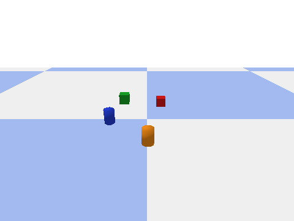

# lang2action

**A robot that understands not just what it sees, but what you tell it — and acts on it.**

Give it a natural-language instruction (*"stack the red cube on the blue box"*, *"move the cup
that's to the left of the bottle"*). It perceives the tabletop as a structured **scene graph**,
reasons over that graph with a **LangGraph agent** to resolve the referring expression and plan the
task, and executes **pick-and-place in PyBullet**. Grounded Vision-Language-Action (VLA), with an
eval harness and a hallucination guard: the agent refuses instructions that reference objects not
present in the scene.

This project composes my other work into one system: perception from
[lightweight-scene-graph](https://github.com/Romi-s) (my MSc thesis pipeline, wrapped here as an
**MCP server**), agentic reasoning patterns from my Visual QA Agent, and the eval/LLMOps discipline
from my Compliance RAG Agent.

## Architecture

```
NL command
   |
   v
[LangGraph planning agent] --MCP tool call--> [Scene-Graph MCP server]
   |  (provider-agnostic LLM)                     |  get_scene_graph / find_object
   |  - ground referring expression               |  / spatial_query
   |  - plan pick-and-place                       v
   |  - hallucination guard              [PerceptionBackend]
   v                                      sim ground truth  |  real SGG over HTTP
[ActionExecutor]  -- v1: PyBullet   (v3: ROS2 + MoveIt)
   |
   v
[Eval harness]  grounding accuracy | task success | hallucination-refusal rate
```

Two deliberate seams:

- **`PerceptionBackend`** — the agent queries the scene graph over MCP and never knows whether it
  came from simulator ground truth (`sim`) or the real scene-graph-generation service (`sgg`).
  The eval reports metrics on both, isolating perception error from reasoning error.
- **`ActionExecutor`** — PyBullet now, ROS2 + MoveIt later, without touching the agent.

## Status / roadmap (v1 in progress)

- [x] Scaffold: package layout, scene-graph schema, spatial-relation inference, CI
- [x] PyBullet tabletop world + ground-truth scene graph + pick-and-place executor
- [x] Scene-Graph MCP server: the robot as MCP tools (see below)
- [x] LangGraph agent: perceive -> ground -> plan -> validate -> execute, with refusal guard
- [x] Eval harness: 30 auto-generated (instruction, scene) cases, three headline metrics
- [x] Real perception backend: camera render -> Lightweight SGG service over HTTP
- [x] Docker + compose (agent + SGG service) + demo GIF
- [x] Fill the metrics table from a live eval run (`lang2action eval`, both backends)

| Metric | sim backend | sgg backend |
| --- | --- | --- |
| Referring-expression grounding accuracy | 0.86 | 0.00 |
| Task success rate | 0.90 | 0.00 |
| Hallucination-refusal rate | 1.00 | 1.00 |
| Over-refusal rate (diagnostic) | 0.09 | 1.00 |

*30 auto-generated cases, `gpt-4o-mini`, v1 single-step agent. Re-run `lang2action eval` after
agent changes to refresh.*

The eval respects `LANG2ACTION_PERCEPTION`, so the same 30 cases score both perception
backends: `sim` isolates reasoning errors (perception is ground truth by construction),
`sgg` adds real detection + relation prediction from my thesis pipeline. The agent's LLM
is called once per instruction (a single structured grounding call); the hallucination
guard that decides refusals is deterministic code, and task success is verified
physically after the world settles.

> **The sgg column quantifies a documented domain gap.** The detector (YOLO-World
> `yolov8s-worldv2`, CPU) was built for real tabletop photos; on clean flat-shaded PyBullet
> renders it finds ~0-1 of 4 objects per scene even at 0.05 confidence (probed across object
> scales, cameras, resolutions, and floor textures - a closer high-res `sgg` camera view is the
> best of them and is what the backend uses). The important part is what the agent does about
> it: unseen objects produce *refusals*, never fabricated actions - the guard treats perception
> gaps and hallucinations identically. Closing the gap (synthetic-domain adaptation of the
> detector + Depth-Anything predicates) is the v2 roadmap.



## The robot as an MCP server

The MCP server owns the simulated world; any MCP client is the robot's brain. It exposes
perception (`get_scene_graph`, `find_object`, `spatial_query`) and action
(`execute_pick_place`, `reset_scene`) tools over stdio:

```bash
python -m lang2action.mcp_server        # or: lang2action-mcp
```

The repo ships a `.mcp.json`, so opening this project in Claude Code offers the
`lang2action-robot` server automatically (adjust the interpreter path to your env) — you can
literally tell Claude Code to "stack the red cube on the blue box" and watch it perceive, plan,
and act through the tools. Scene seed and object count are set via `LANG2ACTION_SCENE_SEED` /
`LANG2ACTION_SCENE_OBJECTS`.

## Quickstart (current state)

```bash
pip install -e ".[dev]"
pytest                     # all tests run against mocks - no API key needed
lang2action scene --seed 42 --render-dir outputs   # seeded scene, ground-truth graph, PNG renders
lang2action demo --out docs/demo.gif               # scripted pick-and-place GIF, no API key
lang2action run "stack the red cube on the blue box"   # the full agent (needs the LLM key)
lang2action eval --n-cases 30 --output report.json     # metrics table (needs the LLM key)
```

With Docker (agent + real SGG perception service):

```bash
docker compose up -d sgg
docker compose run --rm agent run "stack the red cube on the blue box"
```

> **Windows note:** `pybullet` publishes no Windows wheels on PyPI, so `pip install` attempts a
> source build (requires MSVC). Use conda-forge instead:
> `conda create -n lang2action -c conda-forge python=3.12 pybullet=3.25 numpy pillow`,
> then `pip install pydantic typer httpx pytest ruff` inside the env. Linux/CI installs from pip.

Configuration is via environment variables (see `.env.example`). The LLM is a LangChain
`init_chat_model` string, so the agent is provider-agnostic: `openai:gpt-4o-mini` (default),
`anthropic:claude-haiku-4-5`, etc.
